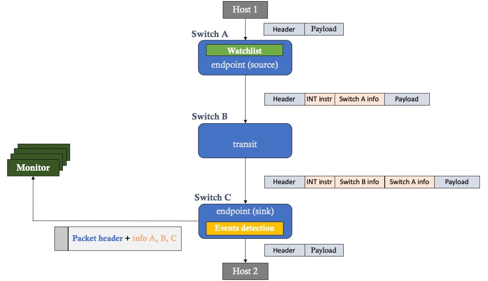
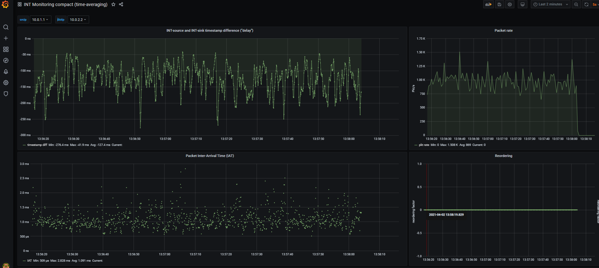

Common P4-based INT implementation for bmv2-mininet and Tofino platforms.
===========================================================================
This is a P4 implementation of the [In-Band Network Telemetry](https://p4.org/specs/). 

The main purpose of this repository is to develop and maintain a P4 implementation of INT common to various programmable platforms. So far, we managed to implement a common implementation in the P4 language for the bmv2-mininet environment and Tofino processors. Much of the INT code is common to both platforms, however there are places in the P4 code that require specific implementations for each platform. This differentiation has been accomplished using preprocessor directives for conditional compilation.The INT implementations for platforms such as DPDK and FPGA, due to numerous limitations, differ too much and are currently being developed in another code repositories. In the future, we hope to integrate all P4 code for INT into one common repository maintained and developed simultaneously for all plaftorms.

The INT implementation and testing was done within the GEANT Data Plane Programmibilty activity:
* https://wiki.geant.org/display/NETDEV/DPP

All INT code is under the Apache 2.0 licence.

In-Band Network Telemetry
------
In-Band Network Telemetry (INT)  is specified by the P4 language community and can provide very detailed information on network behavior by inserting a small amount of information directly inside packets passing through network devices where INT functionality is enabled, essentially adding probing functionality to potentially every packet, including customer traffic. 
This makes INT a very powerful debugging tool, capable of measuring and recording the 'experience' of each tagged packet sent in the network.

P4 implementation of INT
------
This repository contains P4 code implementing the INT data plane functionality. Initially the P4 INT code was developped only for bmv2 but later on it was also adapted for Tofino switches. 
In this repository, we are trying maintain compatibility both with bmv2 and Tofino switches. Limitations of both platforms impacted this codebase.

Two versions of INT are currently available:
- `p4src/int_v0.4/` - version 0.4 of the INT protocol; compatible with the INT implementation contained in the ONOS network operating system; INT version 0.4 documentation is not longer available on p4.org; no longer used and maintained;
- `p4src/int_v1.0/` - version 1.0 of the INT protocol; currently the most tested version of the INT protocol;

Future plans nclude implementating of the INT specification version 2.0.

Note: All INT implementation use 64-bit ingress and egress timestamps (instead of 32-bit timestamps defined in INT specification documents).

Supported dataplane programmable platforms
-----
This repository contains P4 code compatible with bmv2-mininet and Tofino (see `./p4src`) as well as other software specific for particular platform:
- `platforms/bmv2-mininet/` - p4app tool to run INT code within mininet-bmv2 network topology; for more details please check [INT bmv2-mininet documentation](platforms/bmv2-mininet/README.md)
- `platforms/tofino/` - additional helper scripts to run and configure INT node deployed using Tofino-switch (INT Tofino documentation TODO)

Other useful INT software components
----
- [int-collector](https://github.com/GEANT-DataPlaneProgramming/int-collector) for gathering INT reports with monitored flow measurments from one or more INT sink nodes and converting reports into InfluxDB line-protocol messages
- [int-analytics](https://github.com/GEANT-DataPlaneProgramming/int-analytics) containing InfluxDB as main DB for INT measurements as well as visualisation tools like Grafana

Contact
---------
int-discuss@lists.geant.org

